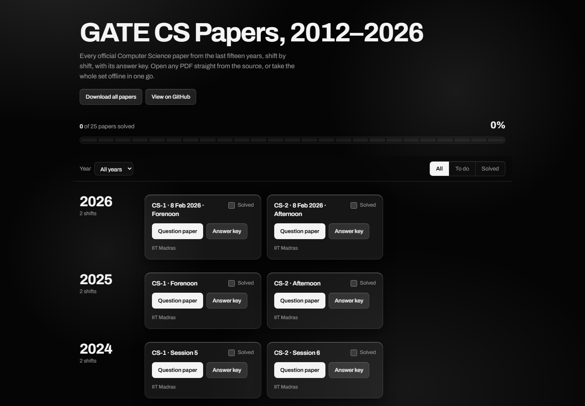

# GATE CS Papers, 2012–2026

**Live site: <https://gatepyq-ten.vercel.app/>**

A frontend-only Next.js site listing all 25 official GATE Computer Science question papers from the last 15 years, shift by shift, with answer keys. Your "solved" ticks are saved in your browser.

## Run the website

    npm install
    npm run dev          # open http://localhost:3000

To build a static site (no server needed, deploy the `out` folder to Vercel, Netlify or GitHub Pages — this repo is deployed at <https://gatepyq-ten.vercel.app/>):

    npm run build

## Download every PDF to your computer

    npm run download

PDFs are saved in `papers/<year>/`, for example `papers/2025/2025-cs1-paper.pdf` and `papers/2025/2025-cs1-answer-key.pdf`.
Anything that fails to download is listed at the end, with the link to the official archive (all papers 2007–2026):
https://drive.google.com/drive/folders/1xUn7rGTzKlfvJDoo4SzCRi8jRlBD63ud

## Editing the list

All papers live in `data/papers.json`. The website and the download script both read from it.

## Sources

- IIT Madras, GATE 2027 downloads: https://gate2027.iitm.ac.in/download (2021–2026 papers and keys)
- IIT Kharagpur, previous papers: https://gate.iitkgp.ac.in/old_question_papers.html (2012–2021 papers)
